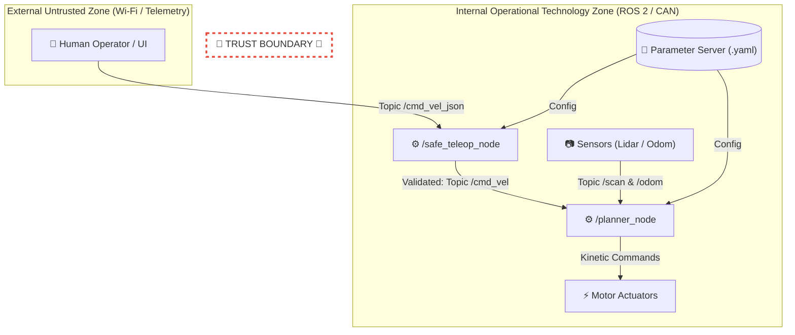

# Lab Assignment: Secure Software Development & Verification in ROS 2

This repository contains the complete reference implementation and verification pipeline for the **ROS 2 Secure Software Development Life Cycle (S-SDLC)** laboratory assignment. It demonstrates how to transition from vulnerable robotic code to a hardened, defensive ROS 2 architecture equipped with kinetic bounds, automated SAST Quality Gates, and SROS 2 DDS-Security access controls.

---

## Table of Contents

- [Background & Objectives](#background--objectives)
- [Architecture & Threat Model](#architecture--threat-model)
- [Project Structure](#project-structure)
- [Key Security Controls](#key-security-controls)
- [Getting Started](#getting-started)
- [Verification & Quality Gate](#verification--quality-gate)
- [SROS 2 Security Policies](#sros-2-security-policies)
- [Evaluation Rubric](#evaluation-rubric)

---

## Background & Objectives

In modern robotics engineering, software vulnerabilities directly translate into **kinetic risks** in physical environments. Security is a core functional requirement that must be integrated into the system during design rather than patched post-deployment.

### Learning Objectives

1. **Analyze Kinetic Risk:** Understand how software defects escalate into physical harm and evaluate the 1x-to-100x cost scaling of security remediation across the robot lifecycle.
2. **Defensive Programming:** Eliminate dynamic execution risks (`eval`, `pickle`), enforce schema validation, and implement physical kinetic limits (clamping).
3. **Automated Verification:** Integrate SAST tools (Bandit, Semgrep) into CI/CD pipelines as blocking Quality Gates.
4. **Least Privilege Enforcement:** Restrict ROS 2 node capabilities using SROS 2 XML security policies.

---

## Architecture & Threat Model

### Data Flow Diagram (DFD) & Trust Boundary

The system separates untrusted external telemetry networks (Wi-Fi) from internal control networks (CAN Bus/ROS 2 OT) via a strict **Trust Boundary**:



### STRIDE Risk Matrix

| Category | Element | Identified Threat | Physical Kinetic Impact |
| :--- | :--- | :--- | :--- |
| **Spoofing** | `/odom` topic | Injected fake odometry packets. | Trajectory deviation and high-speed obstacle impact. |
| **Tampering** | `/cmd_vel` topic | Modification of velocity payloads in transit. | Sudden uncontrolled acceleration or erratic turning. |
| **Repudiation** | Diagnostic Logs | Log deletion or tampering. | Loss of forensic audit capabilities after a kinetic incident. |
| **Information Disclosure** | Camera streams | Eavesdropping on unencrypted Wi-Fi. | Industrial espionage and environmental privacy breach. |
| **Denial of Service** | DDS Message Bus | Packet flooding (DoS). | Loss of keep-alive signals and blocked emergency stopping. |
| **Elevation of Privilege** | Python Node (root) | Arbitrary shell execution. | Full actuator takeover and safety brake override. |

---

### Project Structure

```text
ros2-secure-software-lab/
├── .github/
│   └── workflows/
│       └── sast_ci.yml          # GitHub Actions CI/CD Pipeline (Quality Gate)
├── docs/
│   ├── dfd_architecture.mermaid # Mermaid source code for system DFD
│   ├── sbom_environment.json    # Generated CycloneDX Software Bill of Materials
│   └── stride_matrix.md         # Detailed STRIDE threat analysis matrix
├── policies/
│   └── sensor_processor.xml     # SROS 2 DDS-Security access control profile
├── src/
│   └── secure_teleop/
│       ├── __init__.py
│       └── safe_teleop_node.py  # Hardened ROS 2 node with clamping & fail-safe
├── .bandit                      # Bandit SAST analyzer configuration
├── .gitignore
├── README.md                    # Project documentation
└── requirements.txt             # Environment dependencies


### Key Security Controls

* Elimination of Dynamic Execution: Replaced unsafe eval() and pickle.loads() deserialization with explicit JSON schema parsing (json.loads).
* Kinetic Clamping: Enforces physical safety boundaries on linear velocity ($v \in [-2.0, 2.0]$ m/s) and angular velocity ($\omega \in [-1.0, 1.0]$ rad/s).Fail-Safe Defaults: Any malformed JSON, missing fields, or numerical anomalies (NaN/Inf) immediately trigger an emergency stop state ($v = 0.0$ m/s, $\omega = 0.0$ rad/s) in compliance with ISO 26262 / IEC 61508.


### Getting Started
Prerequisites
- ROS 2 (Humble, Jazzy, or Rolling)
- Python 3.10+
- Bandit & Semgrep SAST tools

### Installation

1. Clone the repository:
```bash
git clone [https://github.com/mmouregarrido/CyberRobotics/tree/main/ros2-secure-software-lab/](https://github.com/mmouregarrido/CyberRobotics/tree/main/ros2-secure-software-lab/)
cd ros2-secure-software-lab
```

2. Install Python dependencies:
```bash
pip install -r requirements.txt
```

3. Source ROS 2 environment:
```bash
source /opt/ros/humble/setup.bash
```

### Verification & Quality Gate
1. Run the Hardened Node - Launch the secure teleoperation node:
```bash
python3 src/secure_teleop/safe_teleop_node.py
```

2. Execute Static Security Testing (SAST) - Run local security checks to verify code compliance before committing:

- Bandit Scan (Fails on High Severity / High Confidence):
```bash
bandit -r ./src -lll -iii
```
- Semgrep Ruleset Analysis:
```bash
semgrep --config auto ./src --error
```

3. Generate Software Bill of Materials (SBOM) - Generate an audit-ready CycloneDX SBOM of all active dependencies:
```bash
cyclonedx-py environment -o docs/sbom_environment.json
```

### SROS 2 Security Policies
Access control is managed via policies/sensor_processor.xml. This profile enforces the Principle of Least Privilege using DDS-Security:
* Subscribed Topics: Read-only access to /scan.
* Published Topics: Write-only access to /cmd_vel.
* Services & Actions: Denied by default (DENY).

To apply security policies with sros2:
```bash
ros2 security generate_policy policies/sensor_processor.xml
```